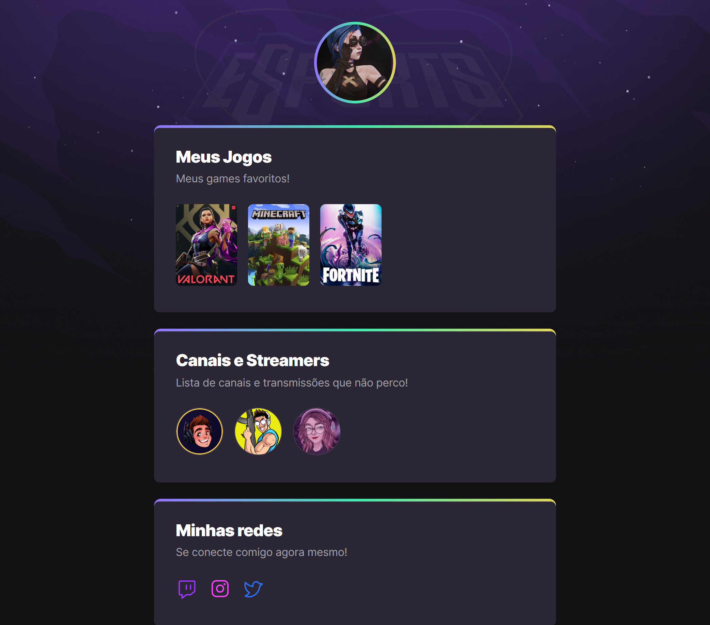

# NLW eSports 

> Trilha Explorer 

Projeto desenvolvido no evento Next Level Week da RocketSeat, focado em Front-end

[Clique aqui para acessar](https://nanatzz.github.io/Projeto-nlw)

## 👾 Tecnologias Utilizadas

- HTML
- CSS
- Git e GiHub

## 📚 O que absorvi do projeto

> Conceitos de CSS e FlexBox que ainda me causavam um pouco de dúvida, e com a mão na massa e os ensinamentos absorvidos, consegui compreender de forma mais sólida sobre

## 💜 Meus Contatos

- natygrott@hotmail.com
- https://www.linkedin.com/in/nathalia-cardozo-grott-8203081a1/